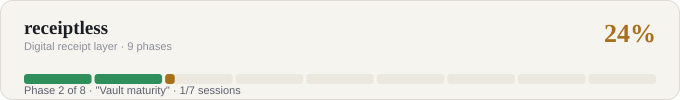

# receiptless

**Every receipt. Automatically. Forever.**



An interoperable digital receipt identity and delivery layer. A purchase
generates a structured digital receipt that reaches your private receipt
vault through whichever channel is available — QR claim link, photo, email,
POS API, or eventually NFC/BLE — gets normalized into one canonical format,
and stays permanently searchable: warranty windows, return windows, tax
categorization, and spend intelligence, all generated automatically instead
of hand-entered.

See [ROADMAP.md](./ROADMAP.md) for the full plan — canonical receipt schema,
the QR claim-token protocol, merchant API/SDK, receipt authenticity/
signatures, merchant terminal + payment-authorization integration, native
apps with platform NFC, and financial intelligence.

See [RECEIPTLESS_STATE.md](./RECEIPTLESS_STATE.md) for exactly what's
currently done vs. pending, and the session-by-session cadence Phase 1 is
being built in — read that before writing any code here. The progress bar
above is regenerated after each session
(`node scripts/generate-progress-svg.mjs`).

## Stack

- [Next.js](https://nextjs.org) (App Router) + TypeScript + Tailwind
- [Prisma](https://www.prisma.io) + Postgres via the `@prisma/adapter-pg` driver adapter
- [Vitest](https://vitest.dev) for tests, run against a real local Postgres (no mocked DB)
- [Zod](https://zod.dev) for API input validation
- [jsQR](https://github.com/cozmo/jsQR) for in-browser QR decoding
- [Recharts](https://recharts.org) for the spend dashboards
- PWA manifest + service worker for install-to-home-screen on any device

## Getting started

```bash
cp .env.example .env
npm install
docker compose up -d          # starts Postgres on localhost:5433
npm run db:generate           # generate the Prisma client
npm run db:migrate            # apply migrations
npm run dev
```

Open [http://localhost:3000](http://localhost:3000).

### Forwarded receipt email (Session 6)

Set `POSTMARK_INBOUND_ADDRESS` to the inbound address assigned by Postmark
and choose strong `POSTMARK_WEBHOOK_USERNAME` / `POSTMARK_WEBHOOK_PASSWORD`
values. A signed-in user can call `GET /api/email/forwarding-address` to get
their opaque plus-address. Configure Postmark's inbound webhook as:

```text
https://<username>:<password>@<your-host>/api/webhooks/email/postmark
```

For a branded address, configure Postmark inbound-domain forwarding or DNS
forwarding to the assigned address. Postmark documents HTTP Basic Auth plus
optional IP allowlisting as its webhook protection; use HTTPS and add the
current Postmark IP ranges at the deployment firewall when available.

The webhook imports text/HTML bodies idempotently as owner-scoped `EMAIL` /
`IMPORTED` receipts. It ignores attachments and never treats email as
merchant-verified. A real Postmark account, domain, public HTTPS deployment,
and end-to-end delivery click-through are still required before production.

### Receipt format adapters (Session 7)

Inbound email is parsed by `src/lib/receipt-adapters/`, which picks a parser
from the email's structure rather than from the retailer's name:

| Adapter | Format | Typical sender |
| --- | --- | --- |
| `order-summary` | Order reference + itemized rows + labelled grand total | E-commerce, food delivery |
| `key-value` | `Label: value` block, single charge, no itemization | Ride-hailing, fuel, subscriptions |
| `pos-slip` | Printed till slip as plain text (fallback) | In-store receipts, forwarded scans |

The first adapter whose `detect()` matches wins; `pos-slip` always matches,
so there is always a parse. A retailer-specific adapter, if one is ever
needed, goes at the front of the array in `registry.ts` — nothing else in
the pipeline changes. Which adapter handled a delivery is recorded on
`InboundEmailDelivery.adapterId`.

> **Fixtures are synthetic.** The adapter tests use hand-written samples
> representative of each format, not real receipts. They verify the adapters
> and dispatch, not that any specific retailer's mail matches — see
> `receipt-adapters/fixtures.ts`.

## Checks (same as CI)

```bash
npm run typecheck
npm run test
npm run build
```

## Data model

`Merchant` → `Receipt` → `ReceiptItem`, with money always stored as integer
minor units (cents) rather than floats, and a `verification` ladder
(`UNVERIFIED` → `IMPORTED` → `MERCHANT_VERIFIED`, with cryptographic
signatures planned) so the system can eventually distinguish a photographed
receipt from an authoritative one issued by the merchant.

## The QR claim-token protocol

Instead of encoding receipt data directly in a QR image, a merchant/terminal
calls `POST /api/merchant/receipts` to create the receipt server-side and
gets back an opaque, expiring, **single-use claim token**. The QR (or link)
encodes only that token. Scanning it hits `GET /api/claim/:token` or the
`/claim/:token` web page, which resolves the real receipt and marks it
claimed — atomically, so it can't be claimed twice, and any later request
with the same token (even before it expires) is rejected with `409` rather
than silently re-serving the receipt. See `src/lib/claim.ts`.

Why this instead of embedding data in the QR: no sensitive receipt data sits
in a scannable image indefinitely, tokens expire, are single-use, and are
revocable, receipts can be signed, and any POS that can display a QR can
participate — no
Bluetooth stack or iOS NFC workaround required. See `ROADMAP.md` for why
this is sequenced ahead of NFC/BLE.

Legacy inline QR payloads (raw JSON or `merchant|amount|currency|date`) are
still parsed as a fallback for retailers who print a QR without integrating
the merchant API — see `src/lib/parseReceipt.ts`.

## Project structure

- `src/app/page.tsx` — dashboard (monthly/annual charts)
- `src/app/receipts` — vault list (with search) + capture flow (QR / photo / manual)
- `src/app/claim/[token]` — public claim-link resolution page
- `src/app/api/receipts` — consumer create/list
- `src/app/api/merchant/receipts` — merchant/terminal push (claim-token issuance)
- `src/app/api/claim/[token]` — claim-token resolution API
- `src/app/api/search` — vault search
- `src/app/api/reports` — monthly/annual aggregation
- `src/app/api/email/forwarding-address` — authenticated per-user forwarding address
- `src/app/api/webhooks/email/postmark` — Basic-authenticated inbound email webhook
- `src/lib/validation.ts` — Zod schemas for every write path
- `src/lib/money.ts` — minor-unit money helpers
- `prisma/schema.prisma` — `Merchant` / `Receipt` / `ReceiptItem` models

## Notes

- Receipt photos use private S3-compatible object storage and owner-scoped
  signed access; local development uses MinIO.
- Accounts and every vault/read/report/photo path are owner-scoped through
  cookie-based sessions.
- `/api/merchant/receipts` is unauthenticated and meant for local/demo use —
  Phase 3 adds real merchant API keys before this is exposed publicly. It
  intentionally marks everything it creates `UNVERIFIED`, not
  `MERCHANT_VERIFIED`: that label must mean "an authenticated merchant key
  created this," which doesn't exist until Phase 3 lands. It also never
  updates an *existing* merchant's `website` from request input — only sets
  one when creating a brand-new `Merchant` row — since an unauthenticated
  caller shouldn't be able to mutate shared reference data by name alone.
- NFC/Bluetooth capture isn't implemented yet — see the roadmap for why
  that's sequenced after the claim-token protocol and merchant API rather
  than first (platform + retailer-partnership dependent, not just code).
